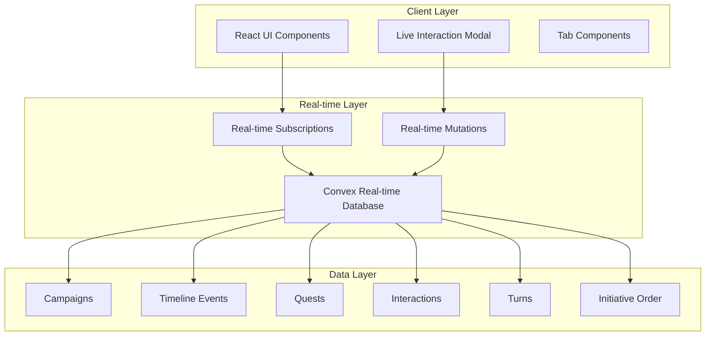
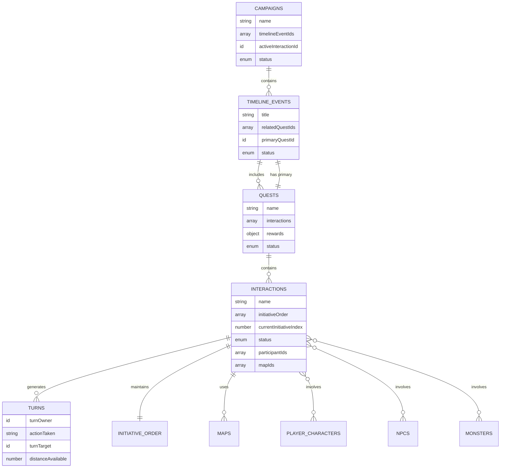

# Design Document

## Overview

The live interaction system is a comprehensive real-time turn-based gameplay feature that transforms the D&D campaign management application into an interactive gaming platform. This system introduces complex hierarchical relationships between campaigns, timeline events, quests, and interactions, while providing a sophisticated real-time UI for managing live gameplay sessions.

The design leverages the existing Convex real-time database infrastructure and React-based UI components to create a seamless multiplayer experience where Dungeon Masters (DMs) and players can participate in synchronized turn-based interactions with automatic initiative tracking, action management, and interactive maps.

## Architecture

### High-Level System Architecture



### Data Relationship Architecture



## Components and Interfaces

### Core Data Models

#### Enhanced Timeline Event Model
```typescript
interface TimelineEvent {
  _id: Id<"timelineEvents">;
  campaignId: Id<"campaigns">;
  title: string;
  description: string;
  status: "idle" | "in_progress" | "completed";
  relatedQuestIds: Id<"quests">[];
  primaryQuestId?: Id<"quests">;
  date: number;
  createdAt: number;
  updatedAt: number;
}
```

#### Enhanced Quest Model
```typescript
interface Quest {
  _id: Id<"quests">;
  name: string;
  description?: string;
  status: "idle" | "in_progress" | "completed";
  interactions: Id<"interactions">[];
  rewards: {
    xp?: number;
    gold?: number;
    itemIds?: Id<"items">[];
  };
  completionXP: number;
  timelineEventId: Id<"timelineEvents">;
  createdAt: number;
  updatedAt: number;
}
```

#### Enhanced Interaction Model
```typescript
interface Interaction {
  _id: Id<"interactions">;
  name: string;
  description?: string;
  status: "idle" | "live" | "completed";
  questId: Id<"quests">;
  campaignId: Id<"campaigns">;
  
  // Initiative System
  initiativeOrder: InitiativeEntry[];
  currentInitiativeIndex: number;
  
  // Participants
  participantPlayerCharacterIds: Id<"playerCharacters">[];
  participantNpcIds: Id<"npcs">[];
  participantMonsterIds: Id<"monsters">[];
  
  // Maps
  mapIds: Id<"maps">[];
  
  // Turn Management
  turns: Id<"turns">[];
  
  createdAt: number;
  updatedAt: number;
}

interface InitiativeEntry {
  entityId: string;
  entityType: "playerCharacter" | "npc" | "monster";
  initiativeRoll: number;
  dexterityModifier: number;
}
```

#### New Turn Model
```typescript
interface Turn {
  _id: Id<"turns">;
  interactionId: Id<"interactions">;
  turnOwner: {
    id: string;
    type: "playerCharacter" | "npc" | "monster";
  };
  actionTaken: string;
  turnTarget?: {
    id: string;
    type: "playerCharacter" | "npc" | "monster";
  };
  distanceAvailable: number;
  turnNumber: number;
  roundNumber: number;
  createdAt: number;
}
```

### UI Component Architecture

#### Live Interaction Modal Component
```typescript
interface LiveInteractionModalProps {
  interactionId: Id<"interactions">;
  isOpen: boolean;
  onClose: () => void;
  userRole: "dm" | "player";
  currentUserId: string;
}

interface LiveInteractionModalState {
  activeTab: "initiative" | "turn" | "action" | "inventory" | "map";
  currentTurnOwner?: InitiativeEntry;
  selectedTarget?: ParticipantEntity;
  availableActions: Action[];
  diceRollResult?: DiceRoll;
}
```

#### Tab Components Structure
```typescript
// Initiative Order Tab
interface InitiativeOrderTabProps {
  initiativeOrder: InitiativeEntry[];
  currentIndex: number;
  onParticipantClick: (entry: InitiativeEntry) => void;
}

// Turn Management Tab
interface TurnTabProps {
  currentParticipant: ParticipantEntity;
  availableActions: Action[];
  onActionSelect: (action: Action) => void;
  onTargetSelect: (target: ParticipantEntity) => void;
  onDiceRoll: (sides: number, modifier: string) => void;
}

// Action Selection Tab
interface ActionTabProps {
  participant: ParticipantEntity;
  actionsTaken: Action[];
  availableActions: Action[];
  onActionSelect: (action: Action) => void;
}

// Inventory Management Tab
interface InventoryTabProps {
  participant: ParticipantEntity;
  onEquipItem: (itemId: Id<"items">) => void;
  onUseItem: (itemId: Id<"items">) => void;
}

// Interactive Map Tab
interface MapTabProps {
  mapId: Id<"maps">;
  participants: ParticipantEntity[];
  currentParticipant?: ParticipantEntity;
  onMovement: (fromX: number, fromY: number, toX: number, toY: number) => void;
}
```

## Data Models

### Database Schema Extensions

#### New Tables

**turns**
```typescript
turns: defineTable({
  interactionId: v.id("interactions"),
  turnOwner: v.object({
    id: v.string(),
    type: v.union(v.literal("playerCharacter"), v.literal("npc"), v.literal("monster"))
  }),
  actionTaken: v.string(),
  turnTarget: v.optional(v.object({
    id: v.string(),
    type: v.union(v.literal("playerCharacter"), v.literal("npc"), v.literal("monster"))
  })),
  distanceAvailable: v.number(),
  turnNumber: v.number(),
  roundNumber: v.number(),
  createdAt: v.number(),
})
```

#### Schema Modifications

**timelineEvents** (Enhanced)
```typescript
timelineEvents: defineTable({
  // ... existing fields
  status: v.union(v.literal("idle"), v.literal("in_progress"), v.literal("completed")),
  primaryQuestId: v.optional(v.id("quests")),
  relatedQuestIds: v.array(v.id("quests")),
})
```

**quests** (Enhanced)
```typescript
quests: defineTable({
  // ... existing fields
  status: v.union(v.literal("idle"), v.literal("in_progress"), v.literal("completed")),
  completionXP: v.number(),
  timelineEventId: v.id("timelineEvents"),
})
```

**interactions** (Enhanced)
```typescript
interactions: defineTable({
  // ... existing fields
  status: v.union(v.literal("idle"), v.literal("live"), v.literal("completed")),
  initiativeOrder: v.array(v.object({
    entityId: v.string(),
    entityType: v.union(v.literal("playerCharacter"), v.literal("npc"), v.literal("monster")),
    initiativeRoll: v.number(),
    dexterityModifier: v.number(),
  })),
  currentInitiativeIndex: v.number(),
  participantPlayerCharacterIds: v.array(v.id("playerCharacters")),
  participantNpcIds: v.array(v.id("npcs")),
  participantMonsterIds: v.array(v.id("monsters")),
  mapIds: v.array(v.id("maps")),
  turns: v.array(v.id("turns")),
})
```

### API Functions Design

#### Initiative Management
```typescript
// Roll initiative for all participants
export const rollInitiativeForInteraction = mutation({
  args: { interactionId: v.id("interactions") },
  handler: async (ctx, args) => {
    // Calculate initiative for each participant
    // Sort by highest initiative
    // Update interaction with initiative order
  }
});

// Get current turn participant
export const getCurrentTurnParticipant = query({
  args: { interactionId: v.id("interactions") },
  handler: async (ctx, args) => {
    // Return current participant based on initiative index
  }
});
```

#### Turn Management
```typescript
// Submit a turn action
export const submitTurnAction = mutation({
  args: {
    interactionId: v.id("interactions"),
    actionTaken: v.string(),
    turnTarget: v.optional(v.object({
      id: v.string(),
      type: v.union(v.literal("playerCharacter"), v.literal("npc"), v.literal("monster"))
    })),
    distanceAvailable: v.number(),
  },
  handler: async (ctx, args) => {
    // Create turn record
    // Advance to next participant
    // Check for combat resolution
  }
});

// Advance to next turn
export const advanceToNextTurn = mutation({
  args: { interactionId: v.id("interactions") },
  handler: async (ctx, args) => {
    // Move to next participant in initiative order
    // Handle round transitions
  }
});
```

#### Real-time Subscriptions
```typescript
// Subscribe to interaction state changes
export const subscribeToInteractionState = query({
  args: { interactionId: v.id("interactions") },
  handler: async (ctx, args) => {
    // Return current interaction state for real-time updates
  }
});

// Subscribe to turn changes
export const subscribeToTurnChanges = query({
  args: { interactionId: v.id("interactions") },
  handler: async (ctx, args) => {
    // Return current turn information for real-time updates
  }
});
```

## Error Handling

### Client-Side Error Handling
- **Connection Errors**: Graceful degradation with offline indicators
- **Permission Errors**: Clear messaging for unauthorized actions
- **Validation Errors**: Real-time form validation with helpful messages
- **State Synchronization**: Conflict resolution for simultaneous actions

### Server-Side Error Handling
- **Database Constraints**: Validation of required relationships
- **Concurrency Control**: Optimistic locking for turn management
- **Data Integrity**: Transaction-like operations for complex state changes
- **Rate Limiting**: Protection against spam actions

### Error Recovery Strategies
```typescript
interface ErrorRecoveryStrategy {
  retryableErrors: string[];
  maxRetries: number;
  backoffStrategy: "linear" | "exponential";
  fallbackActions: {
    [errorType: string]: () => void;
  };
}
```

## Testing Strategy

### Unit Testing
- **Component Testing**: React Testing Library for UI components
- **Function Testing**: Jest for Convex functions
- **State Management**: Testing state transitions and edge cases
- **Initiative Calculation**: Mathematical accuracy of initiative system

### Integration Testing
- **Real-time Synchronization**: Multi-client state consistency
- **Turn Flow**: Complete turn cycle testing
- **Combat Resolution**: End-to-end combat scenarios
- **Database Operations**: Complex relationship management

### End-to-End Testing
- **User Workflows**: Complete DM and player journeys
- **Multi-user Scenarios**: Concurrent user interactions
- **Performance Testing**: Large-scale interaction handling
- **Cross-browser Compatibility**: Consistent experience across platforms

### Test Data Management
```typescript
interface TestScenario {
  name: string;
  participants: {
    playerCharacters: number;
    npcs: number;
    monsters: number;
  };
  expectedDuration: number;
  complexityLevel: "simple" | "moderate" | "complex";
}
```

### Performance Testing Strategy
- **Load Testing**: Multiple concurrent interactions
- **Stress Testing**: Maximum participant limits
- **Real-time Latency**: Sub-second response requirements
- **Memory Usage**: Client-side resource management

## Security Considerations

### Authentication & Authorization
- **Role-based Access**: DM vs Player permissions
- **Interaction Ownership**: Creator and participant validation
- **Action Validation**: Server-side action legitimacy checks
- **Data Privacy**: User-specific information filtering

### Data Validation
- **Input Sanitization**: All user inputs validated
- **State Consistency**: Server-side state validation
- **Turn Validation**: Legal action verification
- **Initiative Integrity**: Anti-cheating measures

### Real-time Security
- **Rate Limiting**: Action frequency controls
- **Session Management**: Secure real-time connections
- **Data Encryption**: Sensitive information protection
- **Audit Logging**: Action tracking for debugging

This design provides a comprehensive foundation for implementing the live interaction system while maintaining scalability, performance, and user experience standards.